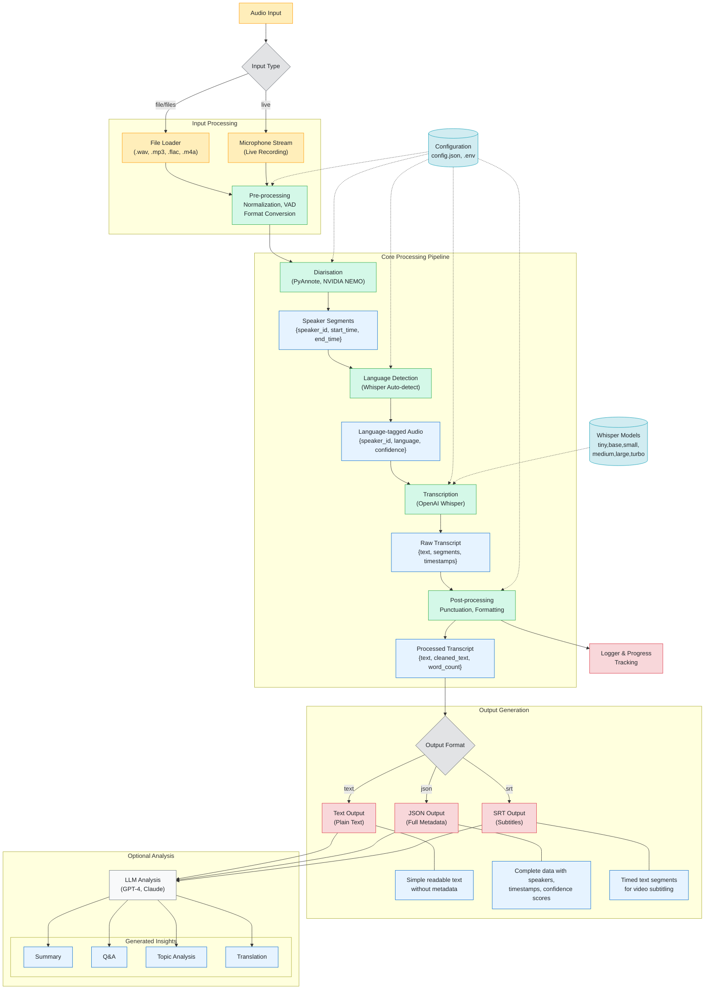

# Transcription Pipeline Structure


## Architecture & Flow Diagram



**Legend:**
- **Input (Orange)**: Audio sources and initial processing
- **Process (Green)**: Computational stages that transform the data
- **Data (Blue Stadium)**: Information flowing between processes
- **Decision (Gray Diamond)**: Branching points in the pipeline
- **Output (Red)**: Final generated artifacts
- **Config (Teal Cylinder)**: Settings that influence processing
- **LLM (Gray Hexagon)**: Optional AI-powered analysis

---

## File Structure

```
Transcription_pipeline/
├── main.py                   # Main CLI orchestrator
├── requirement.txt           # Python dependencies
├── README.md                 # This file
├── .env                      # Environment variable overrides
├── setup.sh                  # Bash setup script (Linux/macOS)
├── main.sh                   # (Reserved for future shell entrypoint)
├── Src/
│   ├── transcription.py      # Core transcription logic (file, batch, live)
│   └── transcription(cpp).sh # Whisper.cpp batch shell script
├── lib/
│   ├── config.py             # Configuration loader and validation
│   ├── config.json           # Default configuration (JSON)
│   └── logger_config.py      # Logging setup
├── Data/
│   └── archive/wav/          # Example input audio files
├── output/
│   └── transcription.txt     # Example output location
├── models/
│   └── ggml-base.bin         # Whisper.cpp model (if used)
└── whisper/                  # Whisper library files (if cloned locally)
```
