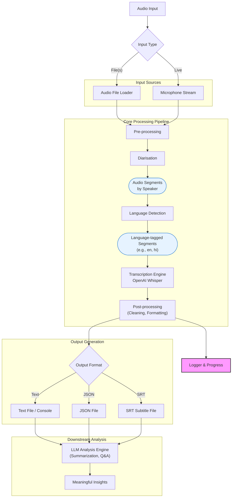

# Transcription Pipeline

## Overview

This pipeline processes audio files and live audio through the following stages:

Sound → Pre-processing (noise) → Diarisation (speaker detection) → Language detection (English / Hindi) → Transcription → Post-processing (LLM correction and formatting)

1. **Sound Processing**: Accepts audio files or live microphone input
2. **Pre-processing**: Audio normalization and format standardization  
3. **Diarisation**: Speaker detection and segmentation
4. **Language Detection**: Automatic language identification (or manual specification)
5. **Transcription**: Speech-to-text conversion using OpenAI Whisper
6. **Post-processing**: Text cleaning, formatting, and output generation

---

## Architecture & Flow Diagram



**Legend:**
- **Audio Input**: Accepts either file(s) or live microphone stream.
- **Pre-processing**: Handles normalization, silence trimming, and format conversion.
- **Diarisation**: Detects and segments speakers in the audio.
- **Language Detection**: Detects spoken language (auto/manual).
- **Transcription Engine**: Uses Whisper (configurable model, device).
- **Post-processing**: Cleans text, adds punctuation, applies LLM correction (optional).
- **Output**: Supports text, JSON, and SRT formats.
- **Logger**: Logs progress, errors, and results.

---

## File Structure

```
Transcription_pipeline/
├── main.py                   # Main CLI orchestrator
├── requirement.txt           # Python dependencies
├── README.md                 # This file
├── .env                      # Environment variable overrides
├── setup.sh                  # Bash setup script (Linux/macOS)
├── main.sh                   # (Reserved for future shell entrypoint)
├── Src/
│   ├── transcription.py      # Core transcription logic (file, batch, live)
│   └── transcription(cpp).sh # Whisper.cpp batch shell script
├── lib/
│   ├── config.py             # Configuration loader and validation
│   ├── config.json           # Default configuration (JSON)
│   └── logger_config.py      # Logging setup
├── Data/
│   └── archive/wav/          # Example input audio files
├── output/
│   └── transcription.txt     # Example output location
├── models/
│   └── ggml-base.bin         # Whisper.cpp model (if used)
└── whisper/                  # Whisper library files (if cloned locally)
```

---

## Features

- 📁 **File Transcription**: Support for multiple audio formats (WAV, MP3, FLAC, etc.)
- 🎤 **Live Transcription**: Real-time speech-to-text from microphone
- 🌍 **Multi-language**: Automatic language detection or manual specification
- 🔧 **Multiple Models**: Choose from Whisper's tiny, base, small, medium, large, turbo models
- 📝 **Output Formats**: Text, JSON, and SRT subtitle formats
- ⚡ **Batch Processing**: Transcribe multiple files at once

---

## Installation

### Quick Setup (Windows)

```powershell
# Run the setup script
.\setup.ps1
```

### Manual Installation

1. **Install FFmpeg**:
   ```bash
   # Windows (Chocolatey)
   choco install ffmpeg
   
   # Windows (Scoop)
   scoop install ffmpeg
   
   # macOS (Homebrew)
   brew install ffmpeg
   
   # Ubuntu/Debian
   sudo apt update && sudo apt install ffmpeg
   ```

2. **Install Python dependencies**:
   ```bash
   pip install -r requirement.txt
   ```

---

## Usage

### Command Line Interface

The main script provides a simple command-line interface:

```bash
# Show help
python main.py --help

# Transcribe a single file
python main.py file audio.wav

# Transcribe with specific model and language
python main.py file audio.wav --model large --language en

# Save output to file
python main.py file audio.wav --output transcript.txt

# Transcribe multiple files
python main.py files *.wav
python main.py files audio1.wav audio2.mp3 audio3.flac

# Live transcription
python main.py live

# Live transcription with specific settings
python main.py live --language en --chunk-duration 3 --model base
```

### Output Formats

- **Text**: Plain text transcription
- **JSON**: Detailed results with metadata
- **SRT**: Subtitle format with timestamps

```bash
# Generate SRT subtitles
python main.py file video.mp4 --format srt --output subtitles.srt

# Get detailed JSON output
python main.py file audio.wav --format json --output results.json
```

### Python API

```python
from Src.transcription import AudioTranscriber, TranscriptionPipeline

# Simple file transcription
pipeline = TranscriptionPipeline(model_name="base", language="en")
result = pipeline.transcribe(mode="file", input_paths=["audio.wav"])
print(result["text"])

# Live transcription
transcriber = AudioTranscriber(model_name="base")

def on_transcription(result):
    print(f"[{result['language']}] {result['text']}")

transcriber.start_live_transcription(callback=on_transcription)
# Speak into microphone...
transcriber.stop_live_transcription()

# Batch processing
transcriber = AudioTranscriber()
results = transcriber.transcribe_multiple_files(["file1.wav", "file2.mp3"])
```

---

## Configuration

### Model Selection

| Model  | Size  | Speed | Accuracy | Use Case |
|--------|-------|-------|----------|----------|
| tiny   | 39M   | Fastest | Basic | Real-time, quick testing |
| base   | 74M   | Fast | Good | General purpose (default) |
| small  | 244M  | Medium | Better | Balanced speed/accuracy |
| medium | 769M  | Slow | High | High accuracy needs |
| large  | 1550M | Slowest | Highest | Best accuracy |
| turbo  | 798M  | Fast | High | Fast + accurate |

### Language Codes

- `en` - English
- `hi` - Hindi  
- `es` - Spanish
- `fr` - French
- `de` - German
- `zh` - Chinese
- And many more...

Leave blank for automatic detection.

---

## Examples

### Basic File Transcription
```bash
python main.py file meeting_recording.wav
```

### Batch Processing with Output
```bash
python main.py files *.wav --output batch_results.json --format json
```

### Live Transcription for English
```bash
python main.py live --language en --chunk-duration 5
```

### High Accuracy Transcription
```bash
python main.py file important_audio.wav --model large --output transcript.txt
```

---

## Troubleshooting

### Common Issues

1. **"FFmpeg not found"**
   - Install FFmpeg using your system's package manager
   - Ensure FFmpeg is in your system PATH

2. **"PyAudio installation failed"**
   - Windows: `pip install pipwin && pipwin install pyaudio`
   - macOS: `brew install portaudio && pip install pyaudio`
   - Linux: `sudo apt install python3-pyaudio`

3. **"CUDA out of memory"**
   - Use a smaller model: `--model tiny` or `--model base`
   - The pipeline will automatically fall back to CPU if CUDA isn't available

4. **Poor transcription quality**
   - Try a larger model: `--model large`
   - Ensure audio quality is good (clear speech, minimal background noise)
   - Specify the correct language: `--language en`

### Performance Tips

- Use `turbo` model for best speed/accuracy balance
- For real-time applications, use `tiny` or `base` models
- Process longer audio chunks (5-10 seconds) for better accuracy
- Ensure good microphone quality for live transcription

---

## Development

### Running Examples
```bash
python example_usage.py
```

### Dependencies
- All core dependencies are in `requirement.txt`.
- Optional dependencies for development/formatting:
  - `faster-whisper`: For improved performance
  - `black`, `flake8`: For code formatting and linting

---

## License
